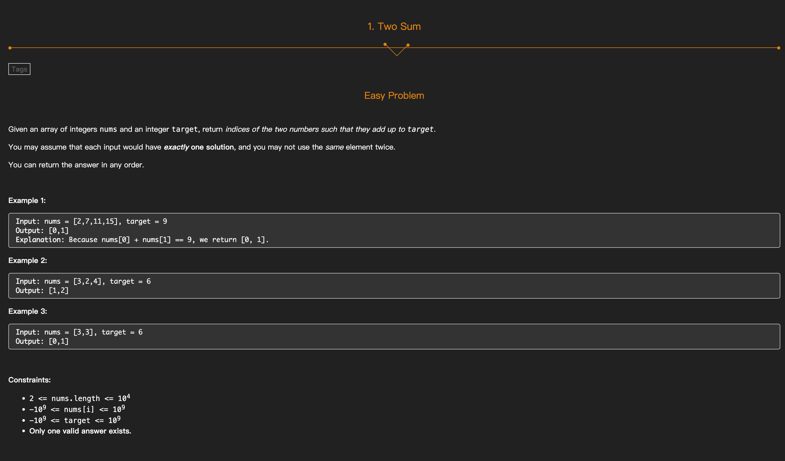
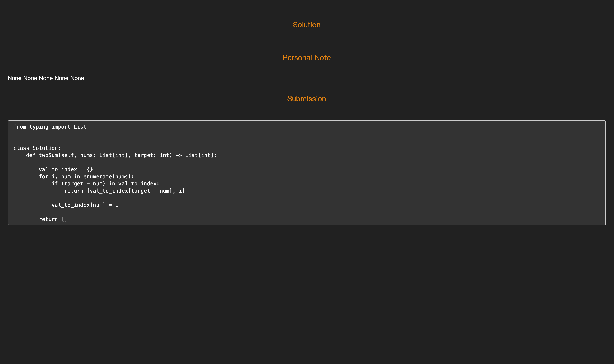

# 📚 Anki Deck Generator for LeetCode Practice

This project is a script-based tool designed to fetch LeetCode questions and generate Anki decks for practicing data structures and algorithms with spaced repetition. By integrating LeetCode problems into Anki flashcards, you can improve your problem-solving skills, retain solutions longer, and prepare effectively for coding interviews.


## 🚀 Key Features

✅ Automatically fetches questions, solutions, and submissions from LeetCode

✅ Generates customizable Anki decks with:

•	Problem descriptions

•	Solution approaches

•	Edge cases, clarifying questions, and common mistakes

•	Personal notes and code solutions

✅ Supports spaced repetition to boost long-term memory of problem patterns

✅ Simple CLI for generating and updating decks


## 🎯 Why Use This Project?

✅ Combines active recall with spaced repetition for better retention

✅ Helps you track your LeetCode progress in Anki

✅ Saves time from manually creating flashcards

✅ Perfect for preparing technical interviews

## 🛠️ Installation Instructions

```
git clone https://github.com/your-username/anki-generator.git
cd anki-generator

# Install dependencies (creates virtual environment)
poetry install

# sync problem list with leetcode account
poetry run python cli.py sync_favourite_list --slug :slug-problem-list --size :number-of-questions

# generate Anki Deck with Favourite Problem List
poetry run python cli.py generate --is_favourite 
```
## 🛠️ Demo





### 🚀 Practice smarter, not harder — strengthen your coding skills with spaced repetition!